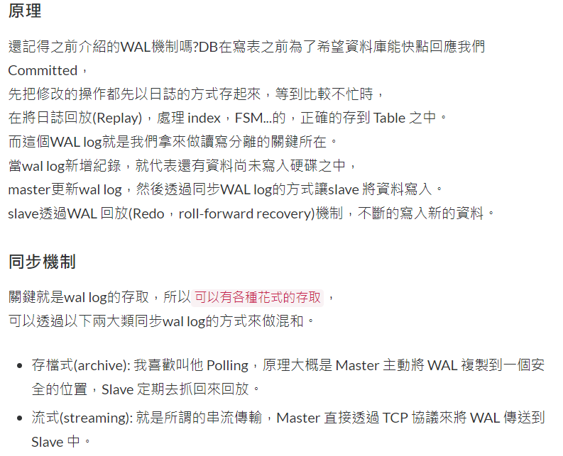
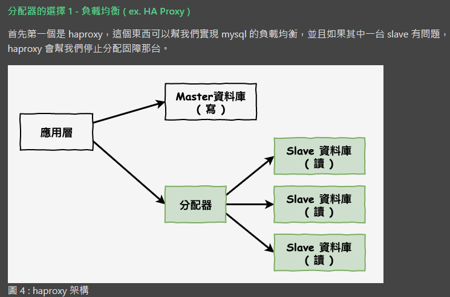
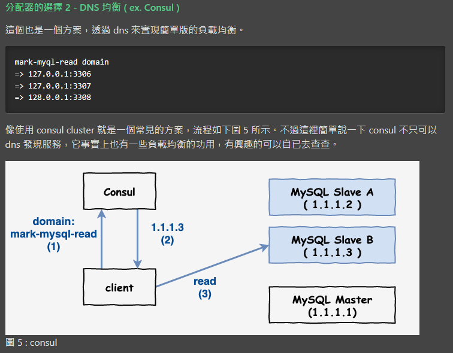
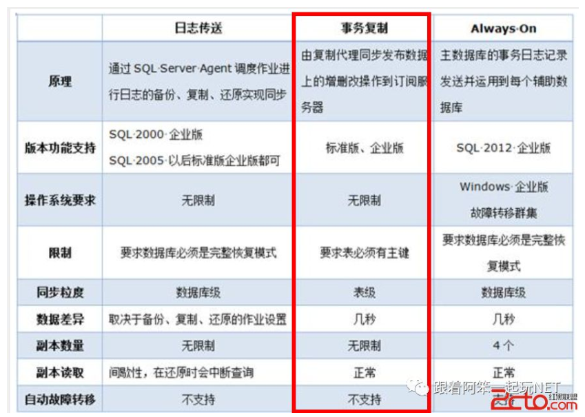
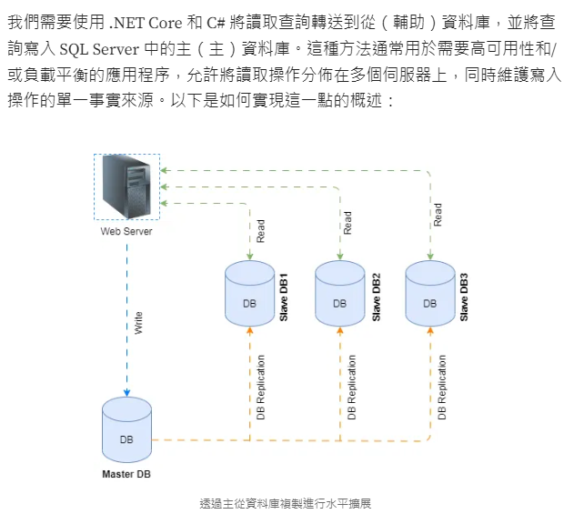
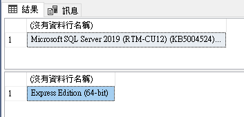
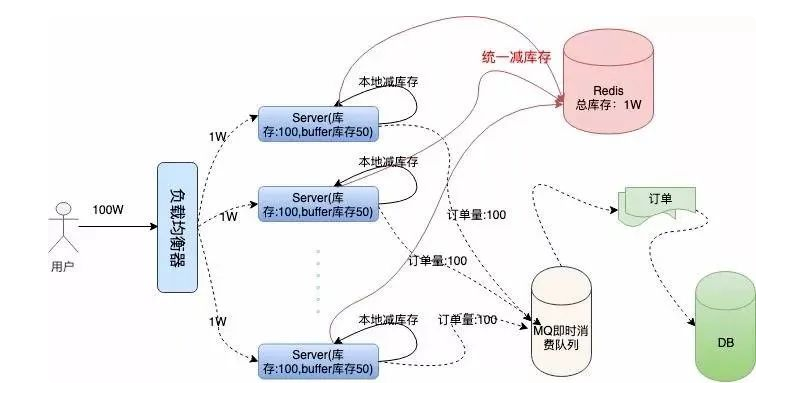

+++
author = "Hailey"
title = "LearnDb"
date = "2024-02-27"
description = "…"
tags = [
    "",
    "",
]
categories = [
    "",
    "",
]
series = [""]
aliases = ["migrate-from-jekyl"]
+++


## Highlight

一、解決方案一：MS SQL Transaction Replication 
   1. `效能優，資料讀寫"幾乎"同步。  `  
   2. 一主Master，一或多Slave
   3. 優：可以對資料進行較細粒度的控制，例如可以選擇性地複製特定的資料表或資料庫  
      缺：在大量寫入的情況下，複製可能會有一定的延遲

二、解決方案二：MS SQL Always On
   1. `效能差`，資料遺失風險小，資料讀寫同步。
   2. 有MSSQL版本限制
   3. 優：提供更高可用性及災難備援移轉服務  
      缺：需要額外的硬體和軟體成本。(版本限制)
   
三、解決方案三：Redis + MQ
   1. 讀寫一律透過Redis。
   2. Redis本身也可做Master-Slave達到讀寫分離架構
   3. MQ定時(或by事件)寫回DB
   4. 設計上較彈性，耦合性較低
   5. 補充：若有需有資料表定時備份，也可另外搭配Replication功能

四、解決方案四(不考慮)：SQL Server In-Memory OLTP(Hekaton) 
   1. 顯少有人使用這方法，資源少
   2. 效能也沒有Redis好
   3. 缺：需要較高技術要求、較少人使用、資源少


## 讀寫分離資料庫

### 適合使用情境：
  1. 高流量的應用程式：當應用程式需要處理大量的讀取請求時，將讀取操作路由到從屬節點可以有效地分擔主節點的負載，提高系統的整體性能。

  2. 讀取操作密集的應用程式：對於讀取操作頻率遠高於寫入操作的應用程式，將讀取操作路由到從屬節點可以提高系統的效能和吞吐量。

  3. 全球部署的應用程式：當應用程式的用戶分佈在全球各地時，使用讀寫分離可以減少跨地區的網絡延遲，提高用戶體驗。

  4. 提高可用性：如果主節點發生故障或需要維護，從節點仍然可以繼續提供讀取服務，從而保證系統的可用性。

  5. 分析型應用程式：對於需要執行大量查詢和分析操作的應用程式，將查詢路由到專用的從屬節點可以避免對主節點的影響，從而保證寫入操作的效能。

    總的來說，讀寫分離資料庫適合於需要處理大量讀取操作、對性能和可用性要求高的應用程式，以及全球部署的應用程式。然而，需要注意的是，讀寫分離可能會增加系統的複雜度和管理成本，並且需要確保從屬節點的數據與主節點的數據保持一致。


### 實作概念
讀寫分離主要的基本原理是將讀取和寫入兩種操作分散到不同的資料庫節點上，基本實現如下：

1. 資料庫集群包含一台主資料庫伺服器(master)及一台以上的從資料庫伺服器(slave)，稱為主從架構(Master-Slave Architecture)
2. master負責讀取和寫入兩種操作，slave只負責讀取操作
3. 若master上的資料有異動，會將異動的部分同步到slave
4. 業務伺服器(API Server)將寫入分配到master，將讀取分配到slave

讀寫分離的實現邏輯並不複雜，但在實際應用過程中需要考慮資料同步時因各種因素導致同步延遲所帶來的複雜性。  
主要導致延遲的因素可能有：
1. 大量的資料同步
2. 伺服器間連線中斷
3. 伺服器分散在不同的環境，網路傳輸速度不同

        例如加入會員，使用者完成加入會員後重新登入系統，若採用讀寫分離，使用者登入時可能master和slave資料庫還未完成資料同步，就會發生登入的帳號不存在的窘境，實際上該帳號確實是存在的。類似這種需要即時查詢的業務，則無法使用讀寫分離，需將讀寫操作集中在同一個資料庫伺服器上。

### 實作細節

* 一筆交易只會對應到一條連線，也就是master和slave同時只會連一個，當有Write會選master，僅read時就會選slave。(待驗證)
* WAL(待了解)：使用WAL log方式進行同步，又分下面兩種  
    1. 存檔式(archive): 我喜歡叫他 Polling，原理大概是 Master 主動將 WAL 複製到一個安全的位置，Slave 定期去抓回來回放。
    2. 流式(streaming): 就是所謂的串流傳輸，Master 直接透過 TCP 協議來將 WAL 傳送到 Slave 中。
    
  圖片來源：https://ithelp.ithome.com.tw/articles/10338310
* 現在許多資料庫都有提供change data capture的功能: 每當一有資料寫入時， 就會通知你，這有點像是是在application level的trigger， 像是MangoDB的Change Streams或是AWS Dynamo的Streams。而RDBMS也有類似的功能，像是postgreSQL的WAL、MySQL的Binlog， 如果是cluster的，內部可能也是利用上述的機制來做複製及備份。(待研究MS SQL)

### 同步模式
1. Async：更新Master成功，即收到Ack確認。後續才進行Master與Salve的同步。Transaction Replication、Always On皆可做到。
2. Sync：更新Master成功，且Master與Salve的同步成功，才收到Ack確認。Always On可做到。  
參考資料：[Always On原理說明](<https://www.sqlshack.com/data-synchronization-in-sql-server-always-on-availability-groups/> "Always On原理說明")


### 分配器的選擇
1. 負載平衡
    
2. DNS均衡


### MS SQL工具的選擇
* SQL Server提供的複製(資料庫同步)選項：例如Always On、交易複製(Transactional Replication)、快照複製(Snapshot Replication)和合併複製(Merge Replication)
  比較圖
  


### 讀寫分離可能面臨問題探討
問題 1 . 主從資料不一致問題  
問題 2 : 讀寫分離模式與緩存服務不一致問題  
詳細參考連結：https://mark-lin.com/posts/20190925/


## .Net core架構實作

##### 開發前準備
  一、 開發前思考：  
  1. Master-->Salve同步的頻率？  可以忍受的replication lag會是多久?(master被寫入時同步/定時同步)
  2. 可以承受的資料遺失率為？是否有資料丟失處理機制？
  3. 使用哪項工具？Always On還是Transaction Replication？
    Always On限制版本：SQL Server Enterprise、Standard、Developer、Web、Evaluation


* 說明：  



二、MS SQL環境準備
* T-SQL指令
  
  ```SQL
  SELECT @@VERSION;   --查詢SSMS版本，EX:2019
  SELECT SERVERPROPERTY('Edition');     -- 查詢為Standard或Enterprise或Develop.....版本。
   ```
    查詢結果  
    
* 啟用Always On服務：  
  1. 在開始頁面上鍵入SQL Server 2019 設定管理員 (適用於 SQL Server 2019 (15.x))或鍵入SQLServerManager15.msc(對於 SQL Server 的其他版本，請將 15 取代為適當的數字)。
  2. 選取 SQLServerManager15.msc後便會開啟組態管理員
  3. 在SQL Server服務裡的SQL Server(MSSQLSERVER)右鍵->內容
  4. 在Always On可用性群組頁籤中，勾選啟用Always On可能性群組


#### 使用此架構注意事項
1. 團隊成員皆需理解此架構，清楚了解何時使用master，何時使用slave，並使用對應的context連線字串，連到對應的資料庫 
2. 當有多台slave時，需有loadBalance機制，以平均分配現在要讀哪一台資料庫
3. 儲存空間：因為有一或多個slave資料庫，硬碟空間需留意
4. 主從複製需要適當的網絡和伺服器設定，以確保高可用性和可靠性


###### 參考連結

https://ithelp.ithome.com.tw/articles/10338310  
https://www.tpisoftware.com/tpu/articleDetails/2769  
https://mark-lin.com/posts/20190925/  
https://medium.com/@shoeb.hasan/mastering-master-slave-replication-enhance-your-net-6536809a3862  
[Always On](<https://blog.csdn.net/qq_41872328/article/details/122615652> "Always On")  
[Transactional Replication](<https://www.yisu.com/jc/544282.html> "Transactional Replication")
[Transactional Replication實作參考1](<https://blog.csdn.net/qq_41872328/article/details/122615652>)  
[Transactional Replication實作參考2](<https://www.cnblogs.com/wei325/p/16516014.html>)  
[Transactional Replication實作參考3](<https://hevodata.com/learn/sql-server-transactional-replication/>)  
[安裝mssql複製元件步驟](<https://www.mssqltips.com/sqlservertip/6250/troubleshooting-sql-server-replication-installation/>)
[Transactional Replication vs AO](<https://dba.stackexchange.com/questions/303129/transactional-replication-vs-ao-for-ms-sql-server>)


## 另一種方式-使用DB Cache

    Survey工具：Redis、SQL Server In-Memory OLTP(Hekaton)

### Redis
-	資料量大的情境，依優先順序考慮：分庫分表-->Redis
-	Redis可實現高併發應用  
-	Issue思考：
      * Queue發送事件更新db 或 每分鐘將redis更新至db  
      * 承上，可能需要lua達成原子性，lua寫相關邏輯或分散鎖，當redis成功更新才寫入MQ
      * Redis撐不住怎麼辦-->加上rate limter
      * AOF避免Redis掛掉資料不見?
  
-  	應用實例一：
        
        架構：1個Redis，1個local server

   1. 將資料讀至Redis
   2. User連至server時，向redis確認此交易資料
   3. 當User CUD時，memory進行處理，並更新至Redis，成功後同步新增MQ，成功後回覆操作成功。若失敗則不更新MQ，並回覆操作失敗。
   4. MQ定時(或依事件)更新db
  
-  	應用實例二：搶票系統  
    
        共10000張票。
        架構：1個Redis，100個local server，使用load balance分散request至100個server，每台server分配到100張票。
        
      1. 將資料讀至Redis
      2. User連至server時，向redis確認此server剩餘票數
      3. 當User訂票時，memory扣減票數，若票數足夠，更新庫存至Redis，成功後同步新增MQ，成功後回覆訂票成功。若票數不足，向Redis要最新票數資訊，並確認是否可訂票。
      4. MQ定時(或依事件)更新db  
   參考資料：https://www.eet-china.com/mp/a166107.html
    


## 其他

### 專有名詞
* ACID  

    ACID是資料庫管理系統（DBMS）中用來確保事務（Transaction）正確執行的四個特性的首字母縮寫。這些特性確保了資料庫操作的可靠性、一致性和完整性。這四個特性是：

    * 原子性（Atomicity）：指事務中的所有操作要麼全部執行成功，要麼全部失敗。如果事務的任何部分失敗，則整個事務將被回滾（Rollback），並恢復到原始狀態，不會留下部分完成的結果。

    * 一致性（Consistency）：指事務在執行之前和之後，資料庫的狀態都必須保持一致性。這意味著事務的執行不會破壞資料庫的完整性約束，例如主鍵、外鍵等。

    * 隔離性（Isolation）：指在多個事務同時執行時，每個事務都應該像沒有其他事務存在一樣。這意味著每個事務必須獨立運行，不受其他事務的影響，從而防止並發執行時可能出現的問題，如讀取脏資料（Dirty Read）、不可重複讀取（Non-Repeatable Read）和幻讀（Phantom Read）。

    * 持久性（Durability）：指一旦事務完成提交，其結果應該永久保存在資料庫中，即使發生系統故障或停機也不受影響。這通常通過將事務的變更記錄到永久存儲介質（如磁碟）來實現。

    這些ACID特性確保了資料庫操作的可靠性和一致性，使得資料庫系統可以處理並發操作、系統故障和其他意外情況，同時保持資料的完整性和一致性。
* MQ  
  MQ是消息佇列（Message Queue）的縮寫，是一種用於在應用程式之間傳遞消息的通信模式。消息佇列系統通常包含了以下幾個主要組件：

   * Producer（生產者）：負責產生和發送消息到消息佇列中。生產者通常是系統中生成消息的應用程式或服務。

    * Queue（佇列）：是消息的存儲和傳遞媒介。它暫存了生產者發送的消息，並且允許消費者從中接收消息。

    * Consumer（消費者）：從佇列中接收消息並處理它們的應用程式或服務。消費者通常是系統中需要處理消息的應用程式或服務。

    消息佇列的特點和優勢包括：

    * 異步通信：生產者和消費者之間是異步的，生產者可以發送消息而不需要等待消費者立即處理。    
    * 解耦：生產者和消費者之間解耦，這意味著它們可以獨立地演進和調整。  
    * 負載平衡：可以有多個消費者同時從佇列中接收消息，從而實現負載平衡和水平擴展。  
    * 排隊：消息佇列可以暫存消息，即使消費者處理速度較慢，也不會丟失消息。  
    * 可靠性：消息佇列系統通常提供了高可靠性和持久性，保證消息的傳遞和處理。  

        常見的消息佇列系統包括 RabbitMQ、Apache Kafka、ActiveMQ、Redis 等。這些系統提供了不同的特性和功能，可以根據具體的應用場景和需求來選擇適合的消息佇列。
* LUA  
  Lua是一種輕量級的、高效的、可擴展的腳本語言，它被廣泛用於嵌入式系統、遊戲開發、應用程式擴展和腳本化等領域。以下是 Lua 的一些主要特點：  
  1. 輕量級和快速：Lua 是一種輕量級的語言，其設計目標之一是保持簡單、小巧和高效。它具有快速的執行速度和低內存消耗，適合用於嵌入式系統和資源受限的環境。
  2. 嵌入性：Lua 被設計為一種可嵌入的語言，可以輕鬆集成到其他主機應用程式中。它具有簡單的 C API，使得開發者可以方便地將 Lua 解析器嵌入到自己的應用程式中，並使用 Lua 來撰寫擴展和腳本。
  3. 可擴展性：Lua 具有強大的擴展能力，可以通過自定義函數和庫來擴展其功能。它支援模塊化、面向對象和函數式編程風格，使得開發者可以按照自己的需求擴展語言。
  4. 靈活性：Lua 具有靈活的語法和動態類型系統，使得開發者可以編寫出簡潔、易讀和易於維護的程式碼。它支援多種基本資料類型和數據結構，包括陣列、字典、函數等。
  5. 可移植性：Lua 是一種跨平台的語言，可以運行在多個不同的作業系統和硬體平台上。它的解析器和運行時庫都是以純 ANSI C 編寫的，因此可以很容易地移植到各種環境中。

  由於這些特點，Lua 在遊戲開發、嵌入式系統、網絡應用程式和其他需要腳本化和自定義擴展的領域中得到了廣泛應用。

* HA  
  HA（High Availability）高可用性是一種系統設計概念，旨在確保系統在遇到故障或中斷的情況下仍能保持可用性和持續運行。具體來說，HA 系統設計旨在降低系統停機時間。  
  總的來說，HA 的目標是確保系統在面對各種故障和中斷的情況下能夠持續運行，從而保證系統的可用性、可靠性和穩定性。這對於對於對業務連續性要求高的應用程式（如金融交易系統、電子商務平台等）尤其重要。


##### 待整理
實現主從資料庫之三種實作方式
1. 同伺服器不同資料庫
2. 不同伺服器不同資料庫
