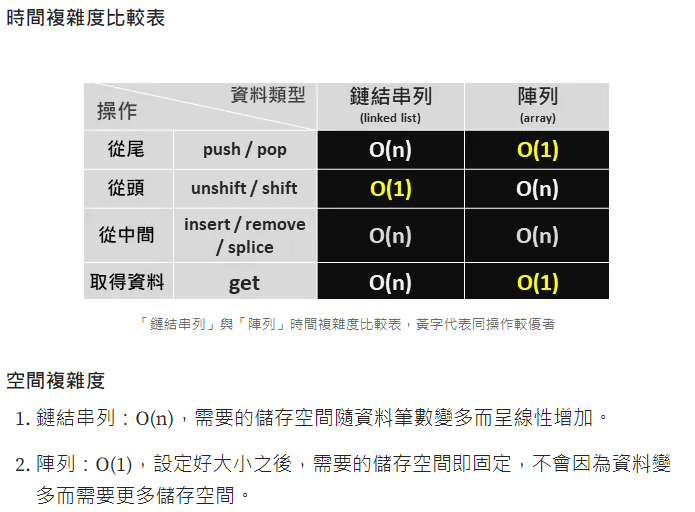

+++
author = "Hailey"
title = "談談遞迴Recursion"
date = "2024-02-27"
description = "…"
tags = [
    "演算法",
    "資料結構",
]
categories = [
    "演算法",
    "資料結構",
]
series = ["演算法"]
aliases = ["migrate-from-jekyl"]
+++

目錄

---

##### 科普一下

> non-decreasing(非遞減)與 increasing(遞增) 是一樣的嗎？  

直接上個例子：  
non-decreasing(非遞減) ： `1 2 3 4`  or `1 1 2 3`  
increasing(遞增) ：1 2 3 4  
非遞減的意思是下一個元素不小於前一個元素，所以 `1 2 3 4`  or `1 1 2 3` 都符合非遞減的條件，  
但只有`1 2 3 4`符合遞增的條件，所以兩種排序方式是有這樣的差別的。

##### 處理Linked-List(鏈結串列)的各種方式：
Push-從尾新增節點  
pop-從尾移除節點  
Shift-從頭移除節點  
Unshift-從頭新增節點  
Insert-從中間新增節點  
remove-從中間移除節點  
get-取得節點資訊：類似Search  

Linked List及Array 時間複雜度比較表

> 思考：比較下來，發現LinkedList的優勢會在從頭新增元素時，不需像Array一樣將所有索引重新計算，但整體看下來，適合用Array的應用情境會比較多，不太確定Singly-Linked-List的重要性為何，待後面有更深入了解再補上吧。
> (有可能使用方式是來做其他演算法如二元樹的基礎)

[參考資料](https://medium.com/@ralph-tech/%E8%B3%87%E6%96%99%E7%B5%90%E6%A7%8B%E5%AD%B8%E7%BF%92%E7%AD%86%E8%A8%98-%E9%8F%88%E7%B5%90%E4%B8%B2%E5%88%97-linked-list-%E9%99%A3%E5%88%97-array-ce8626a2a70 "資料結構學習筆記：鏈結串列（Linked List）& 陣列（Array）")