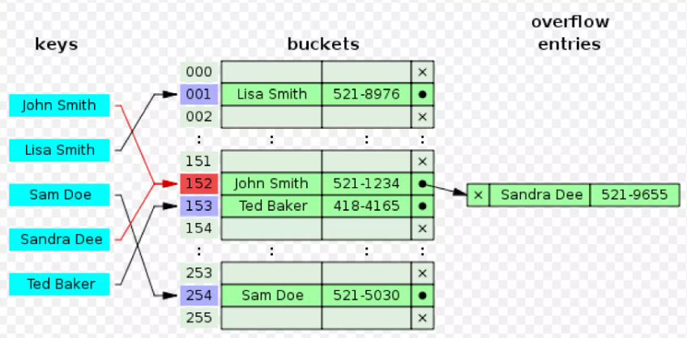

+++
author = "Hailey"
title = "資料結構及演算法學習筆記"
date = "2024-02-27"
description = "資料結構及演算法概觀…"
tags = [
    "演算法",
    "資料結構",
]
categories = [
    "演算法",
    "資料結構",
]
series = ["資料結構及演算法"]
aliases = ["migrate-from-jekyl"]
+++

目錄
- [演算法是什麼](#演算法是什麼)
  - [Chatgpt提供的學習計劃](#chatgpt提供的學習計劃)
- [演算法介紹](#演算法介紹)
    - [Two Pointer](#two-pointer)
- [其他待整理key word](#其他待整理key-word)
  - [資料結構](#資料結構)
  - [演算法](#演算法)

---

  

# 演算法是什麼

{待補}

## Chatgpt提供的學習計劃  

      第一階段：建立基礎

      1. 基本概念
         - 學習演算法和資料結構的基本概念，例如陣列、鏈表、堆疊、佇列等。
      2. 時間複雜度和空間複雜度
         - 理解演算法的時間複雜度和空間複雜度，並學習如何評估演算法的效能。
      3. 排序演算法
         - 學習常見的排序演算法，如冒泡排序、插入排序、選擇排序、快速排序、合併排序等。
      4. 搜尋演算法
         - 瞭解搜尋演算法，包括線性搜尋和二分搜尋。

      第二階段：擴展知識

      1. 圖論
         - 學習圖論相關的基本概念，如圖、路徑、迴路、最短路徑等，以及常見的圖論演算法，如深度優先搜索（DFS）和廣度優先搜索（BFS）。
      2. 動態規劃
         - 瞭解動態規劃的基本原理和應用場景，並學習如何設計動態規劃演算法解決問題。
      3. 貪婪演算法
         - 學習貪婪演算法的基本原理和常見應用，以及貪婪演算法與動態規劃的區別和適用場景。

      第三階段：實際應用

      1. 演算法問題練習
         - 解決各種演算法問題，可以通過線上資源如 LeetCode、HackerRank、Codewars 等網站來進行練習。
      2. 專案應用
         - 在你的 ASP.NET Core 專案中實際應用所學的演算法知識，優化程式碼效能，處理複雜的邏輯問題。  
     
---

# 演算法介紹

### Two Pointer

---
---

# 其他待整理key word
## 資料結構
#### 電腦區分兩種方法：<!-- omit in toc -->
* 大塊：Array
* 小塊：Linked List
   1. 連結數量
      *  一個連一個--->Linked List(鏈結串列)  
      * 一個連兩個--->Binary tree(二元樹)  
      * 一個連多個--->B-Tree 或 B+ Tree(多元樹)
   2. 存放位置
      * 通常存放在記憶體：Linked List、Binary tree
      * 通常存放在硬碟：B-Tree

 
  
Hash Table(雜湊表)：  
混合大塊和小塊的結構，也就是rray當大容器，每一格當中都可以放一個Linked List。至於每個東西要放哪一格，就是由雜湊函數來決定！

 
  

## 演算法  
* 排序 + 二分搜尋法：用來加快Arry的搜尋速度
* 雜湊函數(不確定是否歸類在演算法)

#### 按方法分類 <!-- omit in toc -->
先讀書`培養與鍛鍊程式設計的邏輯腦-程式設計大賫的解題策略基礎入門`再補上一些以下方法，就差不多夠了。
 * 遞增法 Incremental Method
 * 記憶法 Memoization
 * 枚舉法 Enumerative Method
 * 遞推法 Iterative Method
 * 遞歸法 Recrusive Method
 * 分治法 Divide and Conquer
 * 動態規劃 Dynamic Programming
 * 貪心法 Greedy Method
 * 縮放法 Scaling Method
 * 套用模型 Modeling

